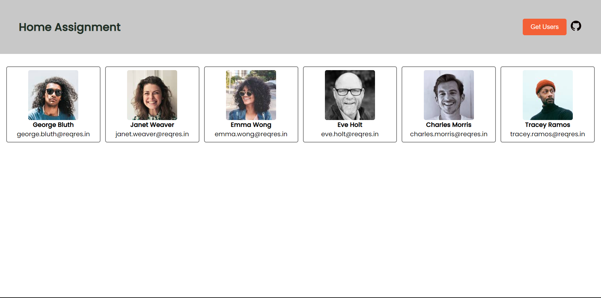

# Assignment 21-03-23
A webApp to fetch data from an API endpoint

## Live Link
Access this [webApp](https://assignment-loader-23-03-23.netlify.app)

## Table of Context:

-[About the App](#about-the-app)

-[Screentshot](#screenshot)

-[Technologies](#technologies)

-[Setup](#setup)

-[Status](#status)

## About the App
This is an assignment webApp which fetches some data from an API endpoint and it paints the data on screen meanwhile showing a loader component. This app is made on industry standard code with react hooks.

## Screenshot

## Technologies
HTML, CSS, JS, React & `Icones` for the icon

## Setup
- download or clone the repository
- run `npm install`

## Status
Completed
